<!-- Back to top -->

<!-- PROJECT LOGO -->
 

  <a href="https://github.com/cdenq/nlp-paper-viz">
    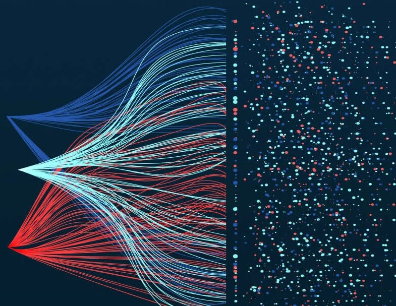
  </a>

  <h3 align="center">NLP Visualizer App Demo</h3>

  

    Full-stack Python platform that summarily visualizes whole domains of academic research for DOD tracking
     
     
    <a href="https://github.com/cdenq/">GitHub Home</a>
    ·
    <a href="https://github.com/cdenq/nlp-paper-viz/issues">Report Bug </a>
    ·
    <a href="https://github.com/cdenq/my-directory">All Projects </a>
  

<!-- Foreword -->
# Foreword
This is an image-gallery-based demo of a full-stack app that I am creating for DOD's NSWC: Crane Research Lab. 

Only images of this app's UI and examples of visualizations have been cleared for public release (hence, the image-gallery-based demo). The data used in this platform is open-source and public (including any aggregate insights derived from using this data), but the developed codebase itself is not yet cleared. This repo contains no code and is purely meant to showcase what this product looks like from a high-level, end-user perspective.

[This project was spotlighted](https://www.navsea.navy.mil/Media/News/Article/3642325/nswc-crane-electro-optics-technology-experts-leverage-nsin-x-force-tool-to-enha/) for outstanding impact by the Naval Sea Systems Command (NAVSEA), which is the parent organization of NSWC: Crane.

<!-- Header -->

# Executive Summary

Academic research often outpaces the Department of Defense’s in-house research in terms of speed and scope. It also involves experimental and emerging technologies that the DOD may not have the time to track. This project aims to enable the DOD to keep a pulse on research movements in academia, which can help them adjust their research budget, policy, and direction to align with new breakthroughs. 

The platform is a full-stack software that can source, clean, store, and visualize research paper meta-data in a variety of user-chosen graphs. For instance, users can track the rise-and-fall of specific scientific keywords over time by country, which can show when countries are starting to invest in research and when that research goes dark (either defunded or privatized). The platform is locally contained, maximally compatible with different machines, and streamlined for non-technical users, as requested by the client.

(<a href="#readme-top">back to top</a>)

<!-- DEMO -->

# Image Demo

Homepage with option to upload dataset.
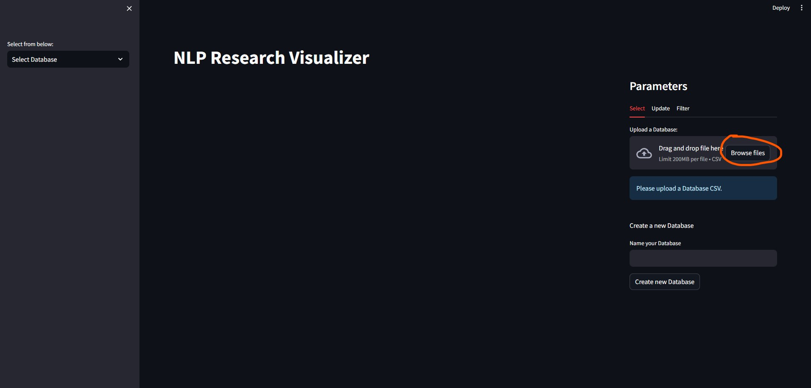

Once loaded, dataset will display first few rows, letting the user know the app is loaded and ready for analytics.
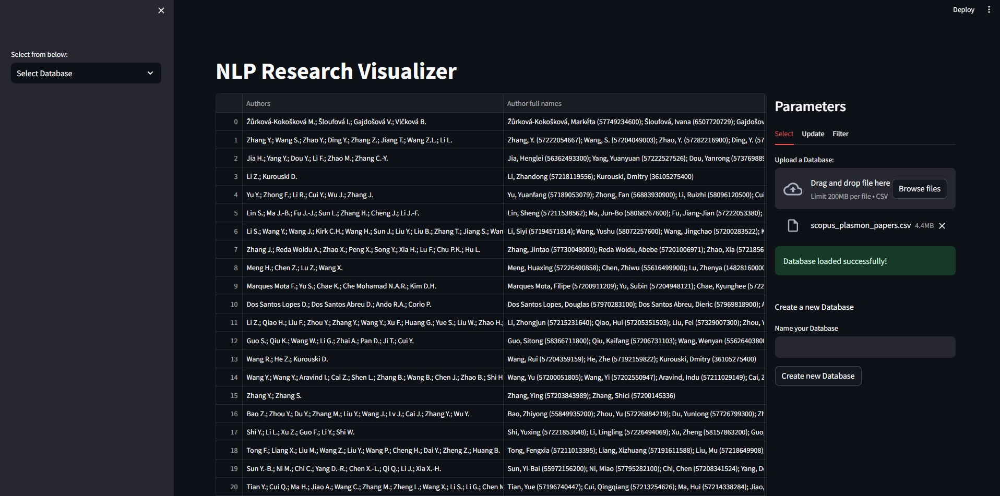

User can optionally augment existing dataset by fetching additional papers through an API call. There are various parameters that govern how that data augmentation will be done.
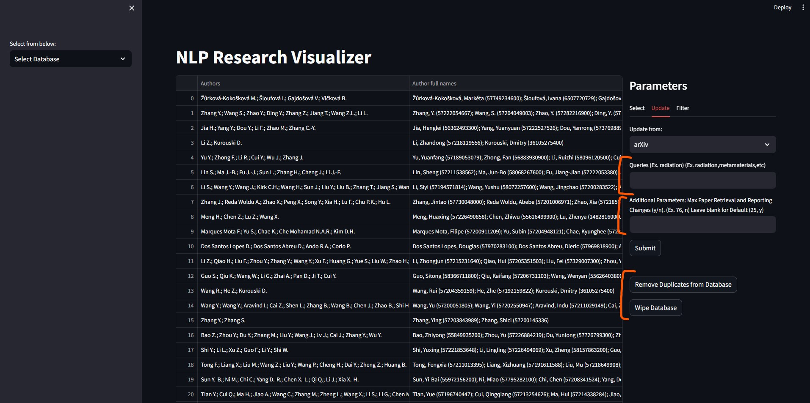

User can optionally filter the existing dataset. Based on client feedback, the user can now slice the dataset via a multitude of paramaters.
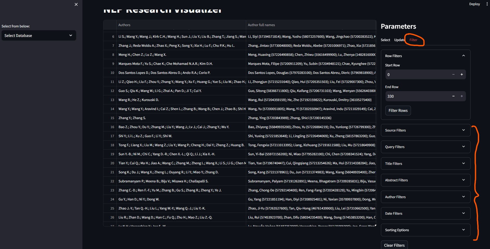

Once done adjusting the dataset, the user can set up graph configurations. They can upload their own pre-saved styles or manually select and save them on this pane. Changes made here will determine things like font-size, color-map, figure-size, font-family, etc. of the various visualizations to come. 
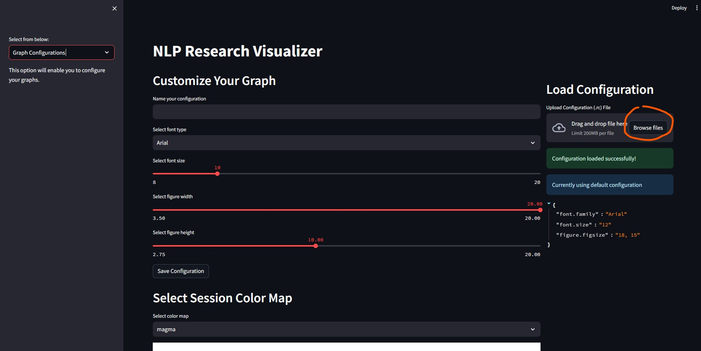
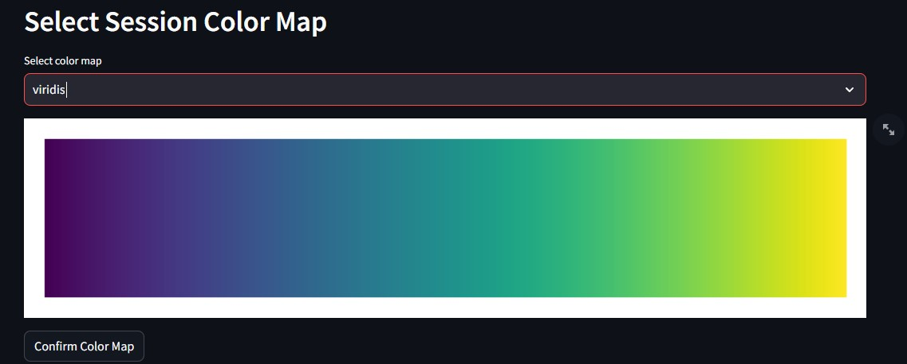

Once done, user can proceed to the analytics section. In general, the user will choose a visualization mode on the right. The data is instantly analyzed and displayed, with additional user options located right below. 
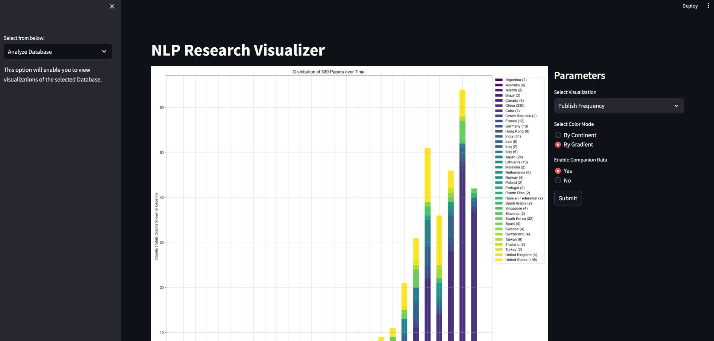
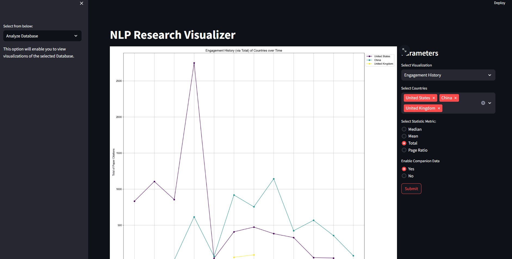

Here are examples of the outputted graphs as well. This is a bubble-map that shows the proximity of extracted scientific terms across queries.
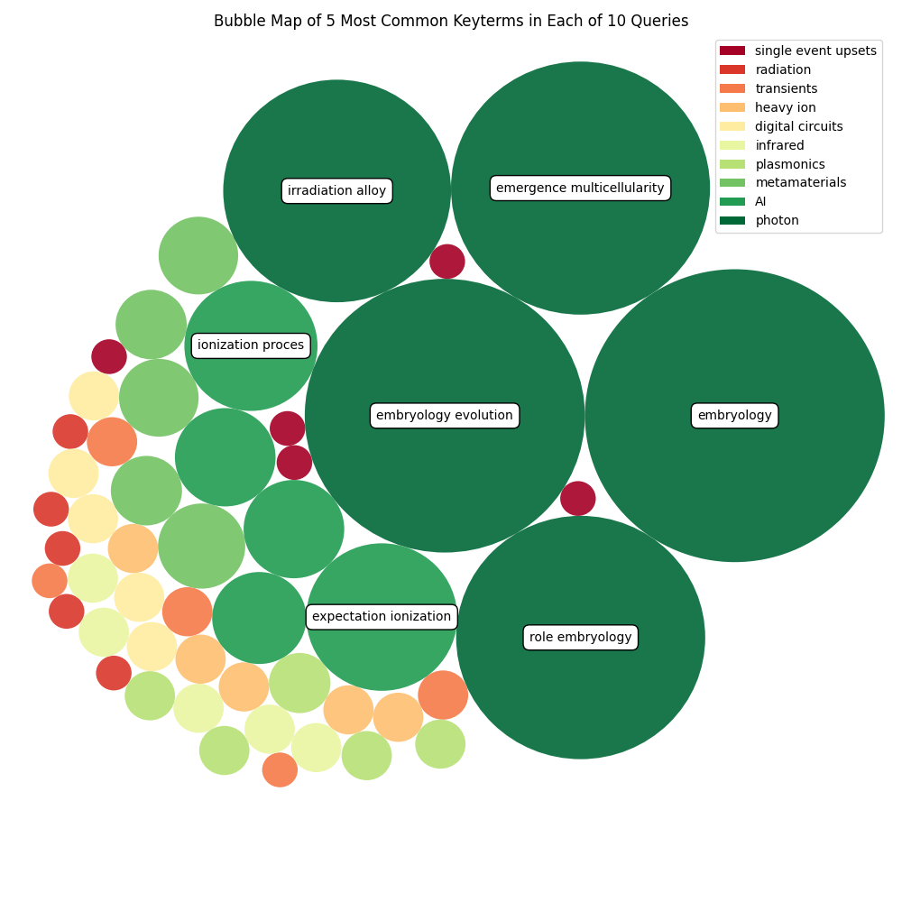

This graph demonstrates the frequency of keywords within 1 query.
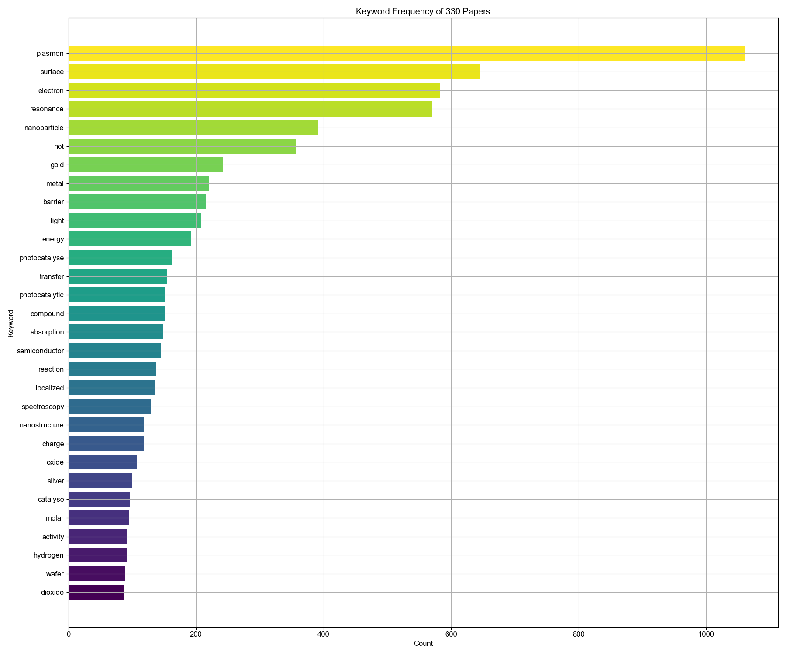

This graph plots the network cooccurence of keywords across queries.
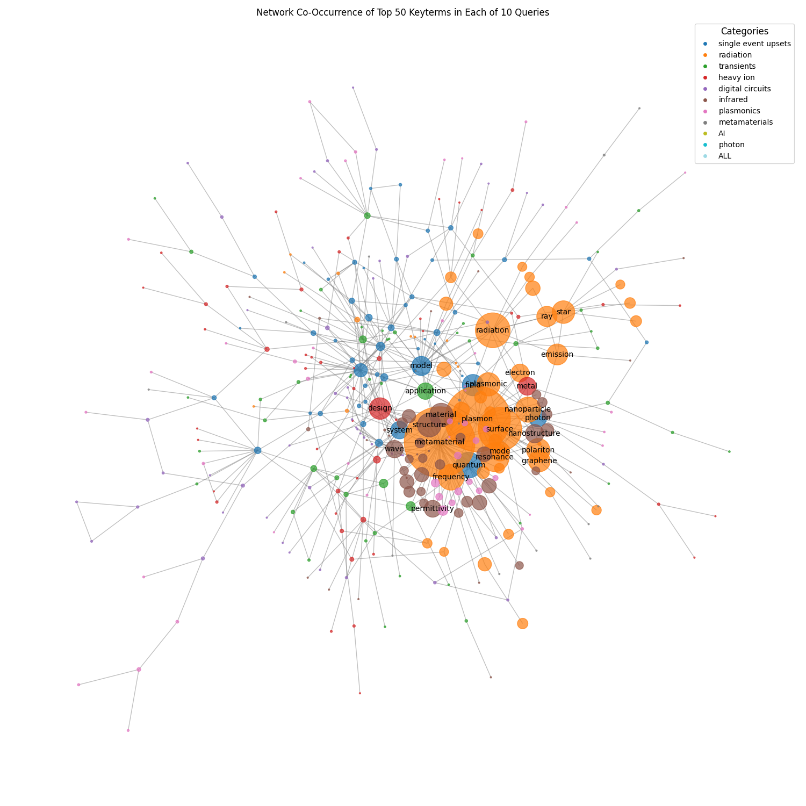

(<a href="#readme-top">back to top</a>)

<!-- CONTACT -->

# Contact

If you wish to contact me, please reach out via [LinkedIn](https://www.linkedin.com/in/cdenq/).

If you're curious about more projects, check out my [website](https://cdenq.github.io/) or [GitHub](https://github.com/cdenq).

(<a href="#readme-top">back to top</a>)

